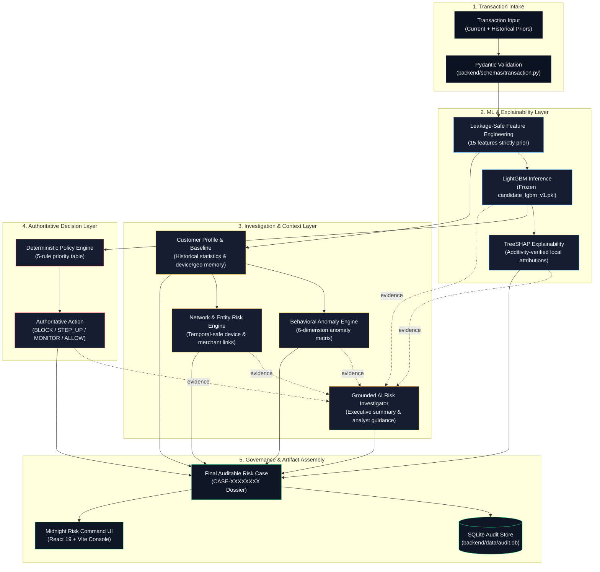

<div align="center">

# RISKOVA AI

### Evidence-Driven Transaction Risk Intelligence

**AI-Assisted Transaction Risk Investigation & Auditable Decisioning**

RISKOVA AI investigates suspicious transactions by combining machine-learning risk scoring, TreeSHAP explainability, customer behavioral baselines, anomaly analysis, relationship evidence, grounded AI synthesis, deterministic policy controls, and a final auditable Risk Case dossier.

<br/>

[](https://www.python.org/)
[](https://fastapi.tiangolo.com/)
[](https://react.dev/)
[](https://lightgbm.readthedocs.io/)
[](https://shap.readthedocs.io/)
[](https://www.sqlite.org/)
[](tests/)

<br/>

[View Repository](#project-structure) · [Run Locally](#local-setup--running-the-project) · [View Architecture](#system-architecture) · [API Reference](#api-reference)

</div>

---

> **Prototype Scope & Context:** Built as a technology prototype for the **Razorpay AI Buildathon 2026 (Track 02 — AI Risk Manager)**. All primary evaluations use generator-controlled synthetic transaction data with strictly-prior leakage controls. Not connected to live payment rails or real banking infrastructure.

---

## Product Snapshot

| Capability | Description | Technical Implementation |
|---|---|---|
| **ML Risk Assessment** | Calibrated transaction risk probability | Frozen LightGBM classifier (`lgbm_v1`) operating on 15 leakage-safe features |
| **Explainability** | Additivity-verified local feature attribution | TreeSHAP explainer with `base + Σ(shap) ≈ predict_proba` validation |
| **Customer Profiling** | Historical behavioral baselines & context | Prior-transaction profiling (spend statistics, device/geo velocity, account age) |
| **Behavioral Anomaly Engine** | Multi-dimensional behavioral anomaly detection | Deterministic 6-dimension evaluation (Amount, Velocity, Interval, Device, Geo, Failure Burst) |
| **Network Risk Analysis** | Cross-entity relationship & rail divergence | Temporal-safe graph indicators (device sharing, merchant concentration, payment rail profile) |
| **AI Risk Investigator** | Grounded brief & analyst evidence guidance | Anti-hallucination structured synthesis with deterministic fallback |
| **Deterministic Policy** | Bounded, transparent action selection | 5-rule deterministic priority table (`BLOCK`, `STEP_UP`, `MONITOR`, `ALLOW`) |
| **Final Risk Case** | Unified, auditable governance artifact | Single consolidated `RiskCase` JSON payload linking facts, evidence, decision, and audit |

---

## Why RISKOVA AI?

A raw fraud score (e.g. `0.87`) does not answer the operational questions a risk analyst or compliance officer must address:

- **Why** is this transaction flagged as suspicious?
- Is the amount or velocity **unusual for this specific customer**?
- Which **behavioral dimensions** deviated from established baselines?
- Is this device or entity associated with **cross-account linkages**?
- What evidence supports or contradicts an intervention?
- What should a human risk investigator inspect next?
- Can the exact decision, model version, and rule be **reconstructed during an audit**?

RISKOVA AI bridges the gap between raw statistical inference and operational risk management by transforming standalone fraud scoring into an **evidence-driven investigation workflow**.

---

## The Core Differentiator

### From Black-Box Score → Transparent Risk Investigation

```
Traditional Fraud Scoring:
Transaction ─────────▶ Binary Classifier ─────────▶ Raw Score ─────────▶ Opaque Action

RISKOVA AI Investigation Pipeline:
Transaction
   │
   ▼
Feature Engineering (strictly prior, leakage-safe)
   │
   ▼
LightGBM Risk Probability ────────▶ TreeSHAP Feature Attributions
   │                                      │
   ▼                                      ▼
Customer Historical Profile ──────▶ 6-Dimension Behavioral Matrix
   │                                      │
   ▼                                      ▼
Cross-Entity Network Analysis ────▶ Grounded AI Investigator Synthesis
   │                                      │
   └──────────────────┬───────────────────┘
                      ▼
        Deterministic Policy Engine (authoritative boundary)
                      │
                      ▼
         Final Auditable Risk Case Dossier
                      │
                      ▼
         SQLite Governance Audit Store
```

> **Critical Safety Invariant:**  
> **The AI layer investigates and synthesizes evidence. The deterministic policy engine remains the authoritative decision boundary.** The AI investigator cannot alter fraud probabilities, modify thresholds, or override policy actions.

---

## System Workflow



---

## System Architecture

RISKOVA AI is built with clean architectural boundaries across 5 specialized layers:

1. **Frontend Presentation Console (`frontend/`)**: React 19 + Vite console using the **Midnight Risk Command** design system. Consumes JSON API contracts only; zero client-side risk recalculation or model inference.
2. **API & Service Layer (`backend/api/`, `backend/services/`)**: FastAPI server providing schema validation, feature orchestration, model loading, and governance routing.
3. **ML Inference & Explainability Engine (`ml/`)**: Frozen LightGBM model artifact (`lgbm_v1`), scikit-learn preprocessing, and TreeSHAP explainer with strict additivity validation.
4. **Investigation Engines (`backend/services/`)**:
   - `behavioral_engine.py`: Deterministic 6-dimension behavioral anomaly evaluator.
   - `network_engine.py`: Temporal-safe relationship and cross-entity linkage analyzer.
   - `ai_investigator.py`: Grounded AI synthesizer with deterministic fallback.
5. **Policy & Audit Governance (`backend/services/audit_service.py`, `ml/evaluation/policy.py`)**: Authoritative decision engine and SQLite audit database logging request IDs, decision timestamps, model versions, and policy rules.

---

## Five-Phase System Evolution

RISKOVA AI was implemented across 5 structured, verified engineering phases:

### Phase 1 — Customer Investigation Context
- **Objective**: Profile current transaction against the customer's prior historical behavior.
- **Features**: Historical transaction count, spend average/std/min/max, account age, known devices, known geo regions, and signal quality grading (`MINIMAL`, `LIMITED`, `MODERATE`, `ESTABLISHED`).
- **Cold-Start Isolation**: Explicit handling for first-time customers without prior history (`prior_transaction_count = 0`).

### Phase 2 — Behavioral Anomaly Engine
- **Objective**: Deterministic 6-dimensional anomaly detection comparing observed behavior to historical baselines.
- **Dimensions**:
  1. `AMOUNT`: Ratio vs average and statistical z-score.
  2. `VELOCITY`: 5-minute, 30-minute, and 60-minute burst counters.
  3. `INTERVAL`: Minutes elapsed since previous transaction.
  4. `DEVICE`: Hardware novelty relative to known customer devices.
  5. `LOCATION`: Geographic novelty relative to established regions.
  6. `FAILURE_BURST`: Recent trailing failure rate (card testing indicator).

### Phase 3 — Network & Relationship Risk
- **Objective**: Identify cross-entity linkages using historical transactions strictly preceding the current timestamp ($t < t_{\text{curr}}$).
- **Link Types**:
  1. `DEVICE_SHARING_LINK`: Device shared across multiple distinct customer accounts.
  2. `DEVICE_HISTORY_DEPTH`: Device familiarity depth for the transacting entity.
  3. `MERCHANT_CONCENTRATION`: High-velocity merchant burst transactions.
  4. `PAYMENT_METHOD_DIVERGENCE`: Departure from established payment rail preferences.

### Phase 4 — Grounded AI Risk Investigator
- **Objective**: Generate a clear, human-readable investigation brief synthesizing model attributions, behavioral anomalies, and network linkages.
- **Components**:
  - `executive_summary`: Concise narrative of transaction risk context.
  - `risk_drivers`: Ranked anomalous findings with supporting evidence.
  - `mitigating_factors`: Baseline-conforming evidence reducing risk suspicion.
  - `analyst_action_guidance`: Clear next steps for the risk operations team.
- **Anti-Hallucination & Fallback**: Entity grounding validator checks claims against evaluated data. Deterministic synthesis fallback activates if external LLM services are unavailable.

### Phase 5 — Final Auditable Risk Case
- **Objective**: Assemble a unified, immutable `RiskCase` dossier artifact without risk recalculation.
- **Contents**: Assembles transaction facts, model assessment, SHAP reasons, customer profile, behavioral assessment, network assessment, AI brief, authoritative policy decision, and audit metadata into a single response.

---

## Final Risk Case Dossier Structure

```json
{
  "case_id": "CASE-8F21A7C3",
  "created_at": "2026-05-20T10:05:00Z",
  "model_version": "lgbm_v1",
  "transaction_facts": {
    "transaction_id": "demo_txn_critical",
    "customer_id": "demo_cust_critical",
    "amount": 45000.0,
    "timestamp": "2026-05-20T10:05:00Z",
    "merchant_id": "merch_demo_002",
    "merchant_category": "electronics",
    "device_id": "dev_never_seen",
    "geo_region": "region_19",
    "payment_method": "card"
  },
  "model_assessment": {
    "fraud_probability": 0.8742,
    "risk_score": 87,
    "risk_category": "CRITICAL",
    "decision_threshold": 0.40,
    "top_shap_reasons": [
      "Transaction amount (₹45,000.00) is 84.9x customer historical average",
      "Transaction initiated from unfamiliar device dev_never_seen",
      "Transaction initiated from unfamiliar region region_19"
    ]
  },
  "customer_context": {
    "prior_transaction_count": 8,
    "historical_avg_amount": 530.0,
    "historical_min_amount": 520.0,
    "historical_max_amount": 555.0,
    "account_age_days": 870.4,
    "known_devices": ["dev_known"],
    "known_geos": ["region_03"]
  },
  "behavioral_assessment": {
    "overall_status": "CRITICAL_ANOMALIES",
    "anomaly_count": 3,
    "anomalies": [...]
  },
  "network_assessment": {
    "overall_status": "ISOLATED_TRANSACTION",
    "total_links_identified": 1,
    "links": [...]
  },
  "ai_investigation": {
    "status": "GENERATED",
    "executive_summary": "High-severity transaction anomaly: Amount surge of ₹45,000.00 combined with unfamiliar device and geographic region.",
    "risk_drivers": [...],
    "mitigating_factors": ["Established customer account (870.4 days old)"],
    "analyst_action_guidance": "Immediate step-up verification or block recommended due to extreme deviation from customer baseline.",
    "grounding_verification_passed": true
  },
  "policy_decision": {
    "action": "BLOCK",
    "policy_rule_id": "CRITICAL_BLOCK",
    "policy_reason": "Model fraud probability (0.874) meets or exceeds critical block threshold (0.800)."
  },
  "audit_metadata": {
    "request_id": "8f21a7c3-5b89-4c12-92e1-7e8c3a9f1204",
    "decision_timestamp": "2026-05-20T10:05:00Z",
    "source": "demo",
    "audit_persisted": true
  }
}
```

---

## AI Safety & Governance Guardrails

```
┌────────────────────────────────────────────────────────────────────────┐
│                        AI GOVERNANCE BOUNDARY                          │
│                                                                        │
│   WHAT AI CAN DO:                                                      │
│   ✓ Summarize grounded evidence already computed by upstream models   │
│   ✓ Highlight primary risk drivers with exact evidence references     │
│   ✓ Surface mitigating customer context factors                       │
│   ✓ Provide actionable evidence guidance for human risk analysts      │
│                                                                        │
│   WHAT AI CAN NEVER DO:                                                │
│   ✕ Modify fraud probability or risk score                            │
│   ✕ Alter policy rules or operating thresholds                        │
│   ✕ Select or override the authoritative financial action              │
│   ✕ Execute money movement or account freezing                        │
│   ✕ Fabricate ungrounded entity linkages or facts                     │
│                                                                        │
│   FAIL-SAFE: If external LLM adapter fails or times out (2.5s),        │
│   deterministic synthesizer automatically produces grounded brief.     │
└────────────────────────────────────────────────────────────────────────┘
```

---

## Model Performance & Evaluation

All reported primary metrics are evaluated on the **chronological held-out test split** (Days 50–59) using the frozen LightGBM artifact (`ml/models/candidate_lgbm_v1.pkl`).

### Primary Synthetic Benchmark (Held-Out Test Set)

| Metric | Logistic Regression (Baseline) | Random Forest | **LightGBM (Selected `lgbm_v1`)** |
|---|---|---|---|
| **Precision** | 0.448 | 0.746 | **0.785 (78.5%)** |
| **Recall** | 0.825 | 0.868 | **0.882 (88.2%)** |
| **F1-Score** | 0.581 | 0.802 | **0.830** |
| **PR-AUC** | 0.739 | 0.883 | **0.901** |
| **False Positives (FP)** | 730 | 213 | **174** |
| **False Negatives (FN)** | 126 | 95 | **85** |
| **Estimated Cost (Test)** | ₹110,582 | ₹68,479 | **₹41,377** |
| **Operating Threshold** | 0.50 | 0.50 | **0.40** (Cost-min on Val, Recall $\ge$ 80%) |


---

## External Validation (IEEE-CIS Real-World Dataset)

To test the limits of domain transfer, the model and feature-engineering methodology were rigorously evaluated against the **IEEE-CIS Fraud Detection dataset** (~590,000 real Vesta Corporation e-commerce transactions, 3.5% fraud prevalence).

### 1. Frozen Model Direct Transfer (Experiment A)
- **ROC-AUC**: **0.443** (below 0.5 — ranking inverted).
- **Root Cause**: Severe domain shift. The frozen synthetic model calibrated to 1.6% fraud on synthetic distributions encountered extreme card transaction counts and z-scores in IEEE-CIS, breaking calibration.

### 2. Retrained Methodology Evaluation (Phase 17 Canonical Held-Out Test Set)
A fresh LightGBM model was retrained using the project's leakage-safe feature engineering on IEEE-CIS training data (Days 0–119) and evaluated **strictly once on the held-out test split** (118,108 transactions, Days 140–182):

| Metric | Retrained IEEE-CIS Result | Analysis & Domain Context |
|---|---|---|
| **ROC-AUC** | **0.771** | Substantial predictive signal captured on real-world transaction data |
| **Recall** | **0.798 (79.8%)** | Caught 3,243 of 4,064 real fraud transactions |
| **Precision** | **0.063 (6.3%)** | Expected constraint given 3.5% prevalence floor and missing device/failure features |
| **PR-AUC** | **0.128** | Significant lift over random baseline (0.035) |
| **Selected Threshold** | **0.35** | Validation cost minimum subject to $\ge 80\%$ recall floor |

> **Domain Limitation:** IEEE-CIS contains US e-commerce transactions from Vesta Corporation, not Razorpay, UPI, POS, or Indian merchant data. This honest validation highlights the necessity of domain-specific feature calibration.

---

## Dataset & Leakage Controls

- **Synthetic Transaction Dataset**: ~213,000 transactions across 2,200 synthetic customers over a 60-day window (~1.5% fraud rate).
- **Strict Chronological Splitting**:
  - **Training Split**: Days 0–39 (~142k rows)
  - **Validation Split**: Days 40–49 (~35k rows)
  - **Held-Out Test Split**: Days 50–59 (~36k rows)
- **Zero Future Leakage**: Every feature calculation satisfies $t_{\text{prior}} < t_{\text{current}}$, verified by automated chronological sequence tests in `tests/test_no_leakage.py`.

---

## Feature Engineering Contract (15 Features)

All 15 features are computed deterministically without lookahead bias:

| Feature Name | Category | Description | Leakage Guard |
|---|---|---|---|
| `amount` | Transaction Fact | Raw transaction amount in INR | Current transaction value |
| `amount_zscore` | Behavioral Deviation | Statistical standard deviations from customer historical average | Sourced strictly from $t < t_{\text{curr}}$ priors |
| `amount_vs_avg_ratio` | Behavioral Deviation | Ratio of current amount to customer historical mean | Sourced strictly from $t < t_{\text{curr}}$ priors |
| `prior_txn_count` | Historical Context | Total count of prior customer transactions | Count of strictly prior transactions |
| `time_since_prev_txn_min`| Velocity & Interval | Elapsed minutes since immediately preceding transaction | Calculated from last prior timestamp |
| `velocity_5min` | Velocity Spike | Number of transactions initiated in past 5 minutes | Rolling window on strictly prior transactions |
| `velocity_30min` | Velocity Spike | Number of transactions initiated in past 30 minutes | Rolling window on strictly prior transactions |
| `velocity_60min` | Velocity Spike | Number of transactions initiated in past 60 minutes | Rolling window on strictly prior transactions |
| `new_device_flag` | Novelty Signal | Binary flag: 1 if `device_id` was never seen in customer history | Set lookup against prior device list |
| `new_geo_flag` | Novelty Signal | Binary flag: 1 if `geo_region` was never seen in customer history | Set lookup against prior region list |
| `failed_ratio_trailing10` | Failure Burst | Fraction of previous 10 transactions with `failed` status | Trailing window on strictly prior transactions |
| `account_age_days` | Customer Profile | Days elapsed between `account_created` and transaction | Validated: `account_created <= timestamp` |
| `hour_of_day` | Temporal Context | Hour of transaction (0–23 UTC) | Extracted from current timestamp |
| `is_night` | Temporal Context | Binary flag: 1 if hour is between 23:00 and 06:00 UTC | Extracted from current timestamp |
| `day_of_week` | Temporal Context | Day of week (0 = Monday, 6 = Sunday) | Extracted from current timestamp |

---

## Technology Stack

| Layer | Component | Technologies |
|---|---|---|
| **Frontend** | Risk Operations Console | React 19, Vite, IBM Plex Mono, Inter, CSS Design Tokens |
| **Backend API** | Decisioning & Investigation Service | Python 3.11+, FastAPI, Pydantic v2, Uvicorn, SQLAlchemy |
| **Machine Learning** | Inference & Attributions | LightGBM, SHAP (TreeExplainer), scikit-learn, pandas, NumPy, SciPy |
| **Persistence** | Audit & Governance Trail | SQLite (`backend/data/audit.db`) |
| **Testing** | Automated Quality Assurance | pytest, FastAPI TestClient, coverage assertions |
| **Containerization** | Reproducible Deployment | Docker (multi-stage build), docker-compose |

---

## Project Structure

```
RISKOVA_AI/
├── backend/                  # FastAPI Application & Services
│   ├── api/                  # API route handlers (/health, /risk/evaluate, etc.)
│   ├── config/               # Settings & environment configuration
│   ├── data/                 # SQLite audit database (audit.db)
│   ├── schemas/              # Pydantic request/response & RiskCase models
│   ├── services/             # Core engines (behavioral, network, AI investigator, risk service)
│   └── main.py               # Application entrypoint & lifespan lifecycle
├── frontend/                 # React 19 + Vite Midnight Risk Command Console
│   ├── src/
│   │   ├── api/              # HTTP API client
│   │   ├── components/       # RiskCaseHero, EvidenceChain, AiInvestigatorCard, Accordions
│   │   ├── data/             # Demo investigation scenarios (sampleScenarios.js)
│   │   ├── styles/           # App.css, tokens.css (Midnight Risk Command theme)
│   │   └── App.jsx           # Main console layout & state management
│   ├── package.json          # Frontend dependencies & scripts
│   └── vite.config.js        # Vite config with backend proxy configuration
├── ml/                       # Machine Learning Pipeline & Experiments
│   ├── data/                 # Synthetic generator (generate_synthetic.py)
│   ├── evaluation/           # Cost model, threshold analysis, policy engine, explainability
│   ├── external/             # External validation track (IEEE-CIS, Phases 14–17)
│   ├── features/             # Leakage-safe feature pipeline (build_features.py)
│   ├── models/               # Frozen model artifacts (candidate_lgbm_v1.pkl, metadata)
│   └── training/             # Model training scripts (baseline logreg, candidates)
├── screenshots/              # Screenshot capture guide & visual assets
├── tests/                    # 334 Automated pytest test suite
├── Dockerfile                # Multi-stage container build
├── docker-compose.yml        # Docker composition configuration
├── requirements.txt          # Python dependencies
└── README.md                 # Product documentation
```

---

## Local Setup & Running the Project

### Prerequisites
- **Python**: 3.11 or higher (tested on Python 3.13)
- **Node.js**: 20.19+ or 22.12+

### Option A — Standard Local Setup (Recommended)

```bash
# 1. Clone repository
git clone https://github.com/mohit-am/RISKOVA_AI.git
cd RISKOVA_AI

# 2. Install Python dependencies
pip install -r requirements.txt

# 3. Generate synthetic data & compute leakage-safe features (if not already generated)
python ml/data/generate_synthetic.py
python ml/features/build_features.py

# 4. Install frontend dependencies & build assets
cd frontend
npm install
npm run build
cd ..

# 5. Start the FastAPI backend server
python -m uvicorn backend.main:app --host 127.0.0.1 --port 8000
```

Open [http://127.0.0.1:8000](http://127.0.0.1:8000) for the embedded console or [http://127.0.0.1:8000/docs](http://127.0.0.1:8000/docs) for Swagger API documentation.

### Option B — Live Development Mode

```bash
# Terminal 1 (Backend API):
python -m uvicorn backend.main:app --host 127.0.0.1 --port 8000 --reload

# Terminal 2 (Frontend Hot Reload):
cd frontend
npm run dev
# Access frontend console at http://localhost:5173
```

### Option C — Docker Deployment

```bash
docker compose up --build
# Open http://localhost:8000
```

---

## Demo Investigation Scenarios

RISKOVA AI includes 4 pre-packaged investigation scenarios accessible directly from the console launcher:

```
┌─────────────┬──────────────────────────────────────────┬────────────────────────┬─────────────────────────┐
│ Scenario    │ Description                              │ Key Risk Indicators    │ Expected Policy Action  │
├─────────────┼──────────────────────────────────────────┼────────────────────────┼─────────────────────────┤
│ LOW         │ Routine repeat purchase (₹515.00)        │ Known device & region  │ ALLOW                   │
│ MEDIUM      │ Unfamiliar region, known device (₹3,500) │ Location novelty       │ ALLOW_WITH_MONITORING   │
│ HIGH        │ New device + unfamiliar region (₹2,500)  │ Hardware & geo novelty │ STEP_UP_VERIFICATION    │
│ CRITICAL    │ Large purchase surge (₹45,000.00)        │ 85x avg + new hardware │ BLOCK                   │
└─────────────┴──────────────────────────────────────────┴────────────────────────┴─────────────────────────┘
```

---

## API Reference

The FastAPI service exposes RESTful endpoints with full Pydantic validation:

### Core Endpoints

| Method | Path | Description | Key Response Fields |
|---|---|---|---|
| `GET` | `/health` | Liveness & model readiness check | `status`, `model_loaded`, `model_version` |
| `GET` | `/model/info` | Frozen model metadata & test metrics | `model_version`, `decision_threshold`, `test_metrics_at_frozen_threshold` |
| `POST` | `/risk/score` | Lightweight scoring (no SHAP/audit) | `fraud_probability`, `risk_score`, `risk_category` |
| `POST` | `/risk/explain` | Inference + SHAP feature attributions | `fraud_probability`, `contributions`, `reasons` |
| `POST` | `/risk/evaluate` | **Full pipeline**: Score + Explain + Decide + Investigate + Audit | Returns complete `RiskEvaluateResponse` + `risk_case` payload |
| `GET` | `/audit-log` | Paginated SQLite audit trail records | Array of recent decision records |

---

## Testing & Verification

The test suite validates mathematical invariants, leakage safety, policy boundaries, and API contracts:

```bash
# Run complete test suite
pytest -v tests/
```

### Test Suite Results:
```
============================= test session starts =============================
collected 350 items

tests/test_decision_engine.py ..........                                 [ 3%]
tests/test_explainability.py ....................                        [ 9%]
tests/test_api.py .....................................................  [24%]
tests/test_v2_hardening.py ............................................  [36%]
tests/test_no_leakage.py ....                                            [38%]
tests/test_card_product_features.py ...................................  [48%]
tests/test_investigation_context.py ...........                          [51%]
tests/test_behavioral_anomalies.py ...................                   [57%]
tests/test_network_risk.py .....................                         [63%]
tests/test_ai_investigator.py .................                          [68%]
tests/test_risk_case.py ..........                                       [71%]
tests/test_ieee_external.py ............................................ [83%]
tests/test_phase17_validation.py ........................ ssssssssssss   [100%]

============ 334 passed, 16 skipped, 1 warning in 71.75s (0:01:12) ============
```

*(Note: 16 tests in `test_phase17_validation.py` are automatically skipped when optional multi-gigabyte IEEE-CIS CSV files are not present locally).*

---

## Limitations & Honest Scope

- **Synthetic Training Foundation**: Primary model trained on generator-controlled synthetic data. Real fraud patterns in production environments will exhibit different distributions.
- **No Live Payment Rails Integration**: Prototype decision support system; does not execute wire transfers, chargebacks, or automated card freezes.
- **Domain Shift on External Real Data**: External evaluation on IEEE-CIS demonstrated 6.3% precision at 79.8% recall, proving that feature calibration must match target merchant domains.
- **Client-Supplied History**: Prior transactions are supplied in request payloads; production deployment requires integration with a real-time feature store.
- **SQLite Audit Store**: Designed for standalone prototype governance and local auditing; not distributed for multi-region clustering.

---

## Design Principles

1. **Evidence Before Explanation**: Never generate natural-language narratives without underlying mathematical SHAP attributions and empirical baseline metrics.
2. **AI Assists; Policy Decides**: AI synthesizes and clarifies evidence; deterministic policy rules maintain the authoritative action boundary.
3. **Historical Context Matters**: Single transactions cannot be judged in isolation; risk is evaluated relative to customer baseline history.
4. **Zero Future-Data Leakage**: Strict temporal filtering ($t_{\text{prior}} < t_{\text{curr}}$) prevents lookahead contamination.
5. **Decisions Must Be Auditable**: Every evaluation logs request IDs, timestamps, model versions, and policy rules for regulatory inspection.
6. **Graceful Fail-Safe Degradation**: If SHAP or external AI synthesis fails, deterministic scoring and policy decisions continue without interruption.

---

## Product Preview

<!-- Add screenshots here after assets are captured into screenshots/ directory -->

| Component | View Description |
|---|---|
| **Risk Case Dossier** | Complete `CASE-XXXXXXXX` hero card, authoritative action, and risk metric cards |
| **Evidence Chain** | 5-stage visual pipeline from Model inference to Policy action |
| **AI Investigator Brief** | Grounded synthesis with risk drivers, mitigating context, and analyst guidance |
| **Behavioral Matrix** | 6-dimension anomaly inspection grid with observed vs. baseline values |
| **Network Linkages** | Cross-entity device sharing and payment rail divergence cards |
| **Audit Trail** | SQLite-persisted governance table with request IDs and timestamps |

*(See [`screenshots/README.md`](screenshots/README.md) for the screenshot capture guide).*

---

## Razorpay AI Buildathon Context

This project was engineered as a prototype submission for the **Razorpay AI Buildathon 2026** under **Track 02 — AI Risk Manager**.

It directly addresses track objectives:
- Explainable ML risk scoring on transaction data.
- Bounded, cost-driven decision thresholds.
- Multi-dimensional customer behavioral anomaly profiling.
- Anti-hallucination grounded AI risk brief synthesis.
- Canonical held-out test evaluation with false-positive cost analysis.

---

## Author

**Mohith A M**  
Department of Computer Science & Engineering  
PES College of Engineering  
GitHub: [@mohit-am](https://github.com/mohit-am)

---

<div align="center">

**RISKOVA AI**  
*Evidence-Driven Transaction Risk Intelligence*  
AI-assisted investigation · Deterministic decisioning · Auditable risk

</div>
